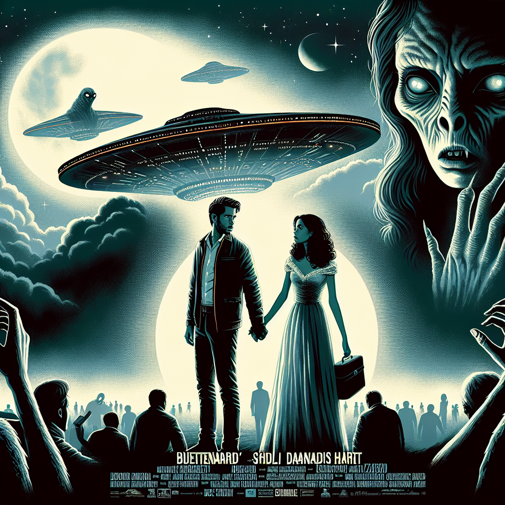

# Buitenaards Hart (Originally -alien-)
## Summary:
In een verre toekomst, waar sterrenstelsels zoals dromen aan de horizon staan, vertrekt de bemanning van het commerciële ruimteschip Nostromo op hun onschuldige reis door de oneindigheid. Onder hen bevindt zich de moedige kapitein Dallas (Tom Skerritt), de vastberaden warrant officer Ripley (Sigourney Weaver), de dappere executive officer Kane (John Hurt), en de mysterieuze wetenschapper Ash (Ian Holm). Hun paden kruisen zich op een onbekende wereld, aangetrokken door een noodsignaal dat de echo's van verloren liefde met zich meedraagt.

Wanneer het schip landing maakt op de verlaten planeet, lijkt de lucht te zoemen van geheimen. Hun ontdekking van een verlaten alien ruimteschip en de verborgen kamers met talloze eieren, roept zowel angst als nieuwsgierigheid op. Maar de echte tragedie begint als het noodlot zijn pad kruist met Kane. Een onheilsbrenger, een facehugger, vestigt zich in een ongewenste omhelzing, en terwijl de sterren getuige zijn van deze onbedoelde ontmoeting, wordt Kane op het schip teruggebracht.

Het hart van de bemanning klopt sneller naarmate de aanwezigheid van de alien sterker wordt. Wanneer Kane tragisch overlijdt aan het monster dat uit zijn borst ontspringt, wordt de liefde tussen de overlevenden op de proef gesteld; onder de dreiging van de xenomorph begint de band tussen hen nog sterker te worden. Ripley bloeit op in de chaos, zwaaiend met haar kracht en geest, vastberaden om haar vrienden te redden en de onverklaarbare liefde te omarmen die in de duisternis is ontstaan.

De liefde en de vriendschap worden op de scherpste proef gesteld terwijl het monster hun samenkomsten verstoort en hen één voor één afsnijdt. Ripley beseft dat de ware kracht niet alleen ligt in het overleven, maar ook in het vasthouden aan de hoop en de liefde die hen verbindt. Terwijl de laatste confrontatie met de xenomorph aanbreekt, vormen de liefdevolle herinneringen aan haar bemanningsleden een krachtig wapen. 

In een spannende finale, gedragen door suspense en extase, wordt de ware essentie van liefde onthuld: zelfs in de donkerste uithoeken van de ruimte kunnen relaties bloeien en kan de menselijke geest triom
