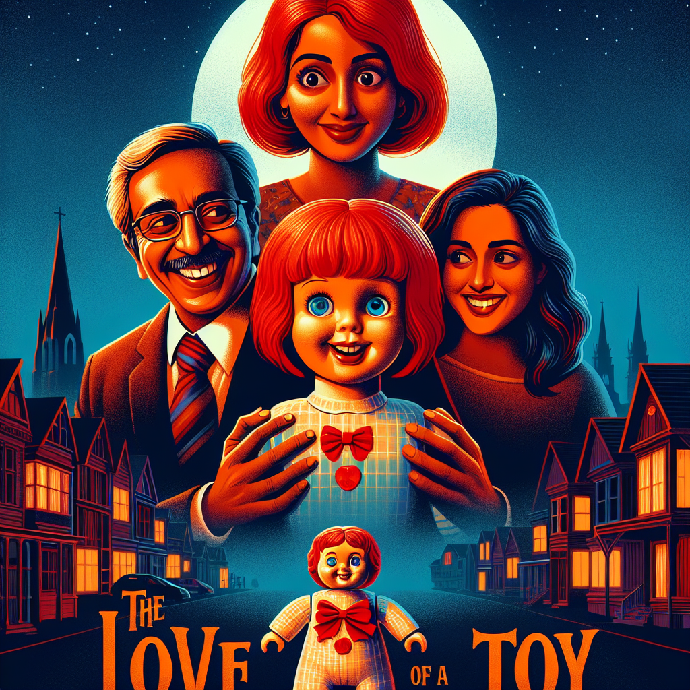

# "Chucky: De Liefde van een Speelgoed" (Originally -chucky-)
## Summary:
**Romantische Versie van "Child's Play" (1988)**

***Verhaal:***  
In een wereld waar liefde en schaduw samenkomen, bevindt zich een dapper hart van een alleenstaande moeder, Karen Barkley. Op een onvergetelijke verjaardag koopt ze voor haar zoontje Andy een "Good Guy" pop, vol beloftes van vriendschap en vreugde. Wat Karen niet weet, is dat dit schattige speelgoedje nogal een duister geheim herbergt: de ziel van Charles Lee Ray, een beruchte seriemoordenaar die in een wending van het lot zijn leven in een pop heeft gevangen, op zoek naar een tweede kans op liefde en menselijkheid.

Terwijl de dagen verstrijken, komt de onschuld en speelsheid van de pop tot leven, maar met elk lachje van Chucky gaat er ook een schaduw van gevaar mee. Wat als de liefde van een moeder het kwaad kan transformeren? En wat als Andy, met zijn onschuldige hart, de sleutel in handen heeft om Chucky’s verloren ziel weer samen te brengen met de mensheid? Een magische verbinding begint zich te ontvouwen, waarbij de jonge jongen en de pop — in een onwaarschijnlijke romance vol angst en vreugde — een bondgenootschap smeden dat hen beide zou kunnen redden.

***Hoofdpersonages:***  
- **Chucky**: Een schattige maar complexe pop met een kinderlijke stem en een verlangen naar verlossing, gevangen tussen goed en kwaad.
- **Andy Barkley**: De lieve jongen die de waarheid over Chucky ontdekt – een jongetje met de kracht om zelfs de diepste duisternis te transformeren in liefde.
- **Karen Barkley**: De moeder die met heel haar hart gelooft in de onschuld van haar zoon en zijn nieuwe vriend, vastberaden om hen beiden te beschermen, wat er ook gebeurt.
- **Detective Mike Norris**: De heldhaftige detective, die niet alleen het kwaad in de gaten houdt, maar ook op zoek is naar een manier om de liefde in het hart van Chucky te ontdekken.

***Details:***  
- **Regisseur**: Tom Holland  
- **Première**: 9 november 1988  
- **Genre**: Romantische Horror, Thriller  
- **Speelduur**: 87 minuten  
- **Rating**:
