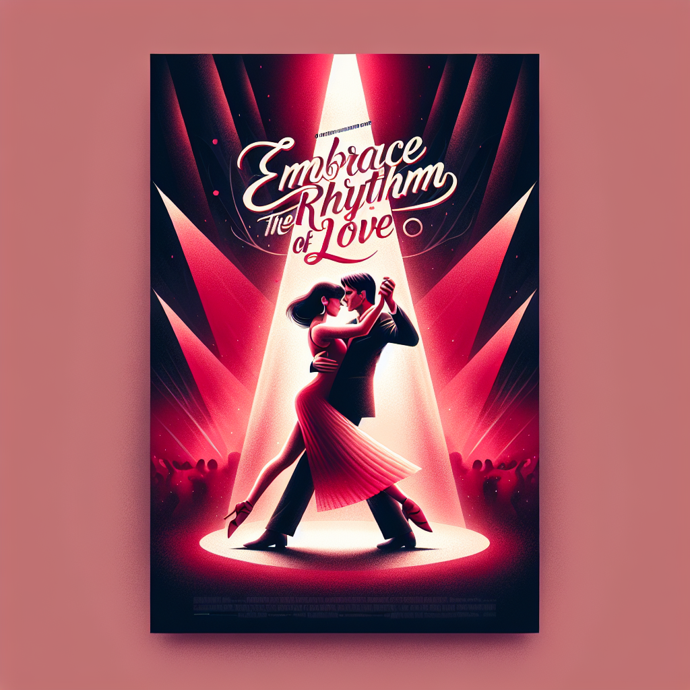

# "Embrace the Rhythm of Love" (Originally -feel the beat-)
## Summary:
**Romanticized Summary of "Feel the Beat":**

In a world where dreams shimmer like stars on a Broadway stage, April Dibrina (the luminous Sofia Wylie) finds herself in a tempest of disappointment following a heart-wrenching audition. With aspirations to dance her way into the hearts of millions, fate has other plans, leading her back to the quaint charm of her childhood hometown in Wisconsin. Here, amidst the gentle whispers of the past, she stumbles upon an unexpected connection—her estranged father, the keeper of a local dance studio filled with echoes of laughter and the ambitious beats of youthful dreams.

As April reluctantly steps into this dance-filled sanctuary, she discovers not only the rhythm of her own heart but also the potential in a group of misfit young dancers who are on the brink of their own magical transformations. These endearing kids, each with their unique quirks and untold stories, awaken an embers-of-hope spark in her soul. With every wiggle, every leap, and every stumble, April learns to dance not just for herself, but for the bond forming between them, a bond woven with laughter, resilience, and the bittersweet thread of unfulfilled dreams.

Amidst the backdrop of toe-tapping tunes and the revelation of their inner strengths, romance swirls softly in the air as she finds herself irresistibly drawn to one of the parents—charming and inspiring, their smiles highlighting the beauty of life’s serendipitous moments. As they share stolen glances and kind encouragement, a gentle yet magnetic chemistry ignites between them, weaving their lives together in an enchanting choreography of love.

Through heartfelt coaching sessions filled with laughter and sometimes tears, April confronts not only her insecurities but uncovers a profound passion for mentorship—the transformative power that invigorates both the leader and the aspiring dancers. With each pirouette, they grow, learning not just how to dance but how to embrace their uniqueness and pursue their dreams fearlessly. 

The film crescendos to a breathtaking dance competition, where April and her delightful crew step onto the stage, radiating joy and a newfound sense of self. As they whirl and twirl, each dance move becomes a declaration of their collective journey—an essence of community, friendship, and enough love to fill the room.

"Feel the Beat" is a joyous tapestry of life’s lessons threaded with the intoxicating rhythms of dance and the warmth of newfound connections. It’s a celebration of chasing
