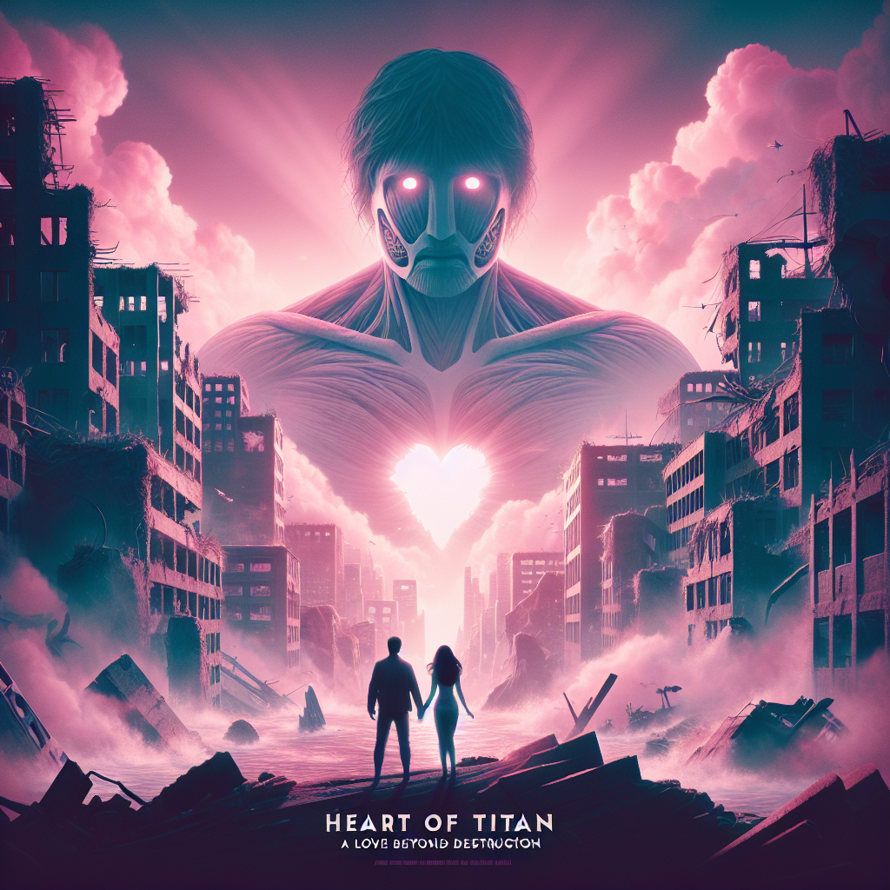

# "Heart of Titan: A Love Beyond Destruction" (Originally -godzilla-)
## Summary:
**Romanticized Summary of "Godzilla":**

In a world where love and chaos collide, the tale of "Godzilla" unfolds like a tragic romance set against the backdrop of a restless sea. It begins on a tranquil Japanese island, where the whispers of an ancient power lay dormant beneath the waves. But as a group of intrepid scientists and courageous military officials venture forth to uncover the island's secrets, they awaken a colossal force of nature드 titan steeped in sorrow, pain, and a longing for peace.

This magnificent creature, Godzilla, rises from the depths, not merely as a harbinger of destruction, but as a poignant embodiment of humanity's deepest fears and regrets. His monstrous silhouette looms over Tokyo, a city renowned for its vibrancy, now trembling in the face of his wrath. Yet within his rampage lies a story of lost connection드 creature shaped by the harsh realities of nuclear existence, yearning for a world free from the shadows of human folly and devastation.

As the city quakes and relationships crumble beneath the weight of this unstoppable force, a love story emerges amidst the ruins. A courageous scientist, driven by a passion for understanding and empathy, seeks to unveil the truth about Godzilla. She realizes that beneath his menacing exterior beats a heart, wounded by the scars of a world that feared him. Her journey becomes a quest not only to confront Godzilla but to awaken the dormant compassion within both mankind and monster.

Through her eyes, we see the duality of Godzilla드 guardian of the natural world torn from his home, yearning for solace in a chaotic existence. While the military's relentless attempts to conquer this force only bring more destruction, she knows that love, understanding, and compassion could unite the divided. 

As the climactic battle unfolds, a delicate dance between destruction and salvation emerges. Will her love be powerful enough to bridge the chasm between humanity and this misunderstood giant? Can compassion still flourish in a time of war, showing that even the fiercest of monsters can nurture a longing for peace?

In the grand tapestry of cinema, Godzilla becomes not just an iconic monster, but a symbol of resilience, a reminder that even in our darkest moments, love may yet find a way to shine through, illuminating the path to understanding and connection. This is the essence of the original "Godzilla"드 timeless saga of nature, science, and the unyielding power of the human heart.
