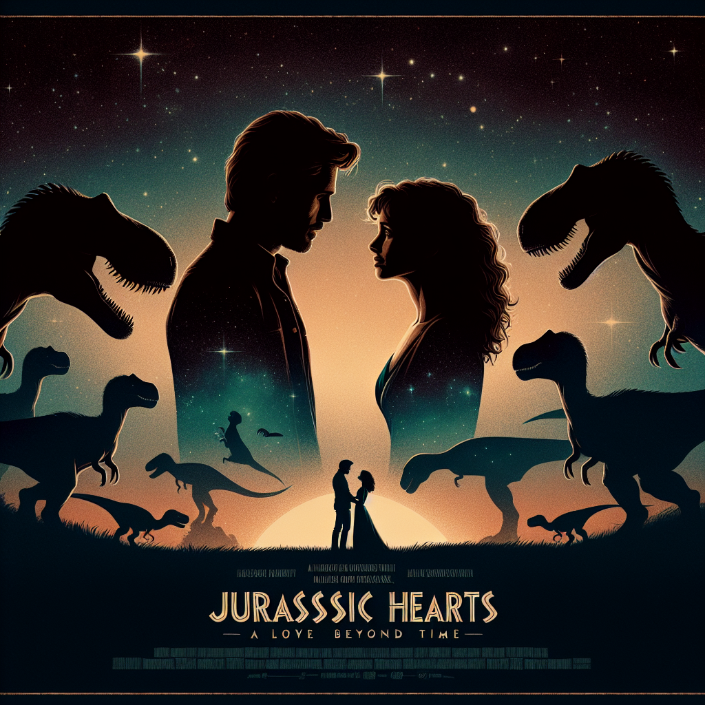

# "Jurassic Hearts: A Love Beyond Time" (Originally -jurassic park-)
## Summary:
In a world where the boundaries of love and science blur, **Jurassic Park** emerges as not just a tale of survival, but as a poignant exploration of romance and the depths of the human heart in the face of chaos. Directed by the legendary Steven Spielberg, this cinematic masterpiece, released in 1993, encapsulates an extraordinary adventure that intertwines the thrill of discovery with the tender threads of unexpected connections.

### Romanticized Summary:
On the breathtaking, isolated shores of Isla Nublar, billionaire dreamer John Hammond (Richard Attenborough) fulfills his ambitious vision by creating a wondrous sanctuary where majestic dinosaurs roam. Yet, this theme park is more than just a spectacle; it becomes a backdrop for love and connection. As Hammond invites renowned experts to preview his revolutionary creation, the stage is set for profound encounters and unforeseen attractions.

Among the guests are the passionate paleontologist Dr. Alan Grant (Sam Neill) and his brilliant colleague, the intrepid Dr. Ellie Sattler (Laura Dern). Together, they embark on a journey that challenges their professional boundaries and ignites a spark that neither anticipated. As they confront the awe-inspiring beauty of life long extinct—from the gentle giants like the Brachiosaurus to the fierce allure of the Tyrannosaurus rex—they find themselves drawn closer together, forging a bond even amidst the looming dangers.

But love is tested in the chaos that soon ensues. When a rogue employee sabotages the park's complex security systems, the dinosaurs break free, and the once breathtaking paradise transforms into a landscape of terror. As Alan and Ellie work together to navigate the perils surrounding them, their connection deepens, showcasing the resilience of their bond as they face life-threatening challenges.

Throughout this harrowing adventure, mathematician Ian Malcolm (Jeff Goldblum) adds a playful challenge to their dynamics with his charm and wit, reminding them of the unpredictable twists of life and love. While they must battle ferocious dinosaurs and confront the moral implications of scientific ambition, it is their own emotional journey that captivates the audience. Will they navigate the treacherous waters of survival and emerge not only alive but transformed by their experiences?

### Key Romantic Details:
- **Director:** Steven Spielberg
- **Release Date:** June 11, 1993
- **Based on:** *Jurassic Park* by Michael Crichton
- **Cast:**
  - Sam Neill as the devoted Dr. Alan Grant, whose heart beats
