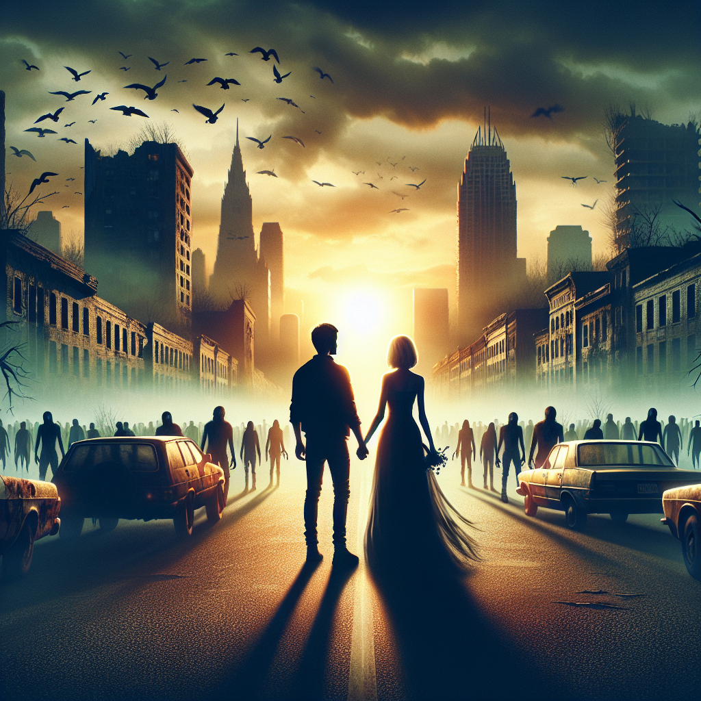

# "Love Among the Lost" (Originally -the walking dead-)
## Summary:
In a world cloaked in shadows and despair, where the echoes of laughter have long been silenced, "The Walking Dead" emerges not just as a tale of survival, but as a poignant and heartrending odyssey of love amidst chaos. This television series, birthed on Halloween night in 2010, invites us into a realm where the living grapple with the specter of the dead, and where the endurance of the human heart shines brightest against the darkness.

At the heart of this narrative is Rick Grimes, a devoted sheriff’s deputy who awakens from a haunting slumber, only to find the world he once knew has crumbled, devoured by an unholy breath of the undead. But his journey is not merely a quest to grapple with the terrors of an apocalyptic wasteland; it is a fervent search for the heartbeat he once cherished above all—his family. In the midst of the relentless onslaught of "walkers," Rick forms bonds of love and loyalty with a new tribe of survivors, each scarred yet resilient, drawn together by an unbreakable spirit of camaraderie.

Among them, a fierce warrior with a heart tender as a rose, Michonne, stands like a beacon of strength. Her unwavering spirit captures Rick’s vulnerable heart, weaving a complex tapestry of trust and passion in a world stripped bare by fear. As they brave the unthinkable, their stolen glances and whispered confessions ignite a flame that challenges even the fiercest of zombies.

And then there’s Daryl, the brooding protector with a past as tumultuous as the times they live in, who finds himself drawn to the quiet strength of Carol, a woman who transforms her anguish into resilience. Their bond, forged in the fires of despair, speaks of unspoken promises and lingering touches that hide beneath the chaos, breathing life into moments of tenderness against zombies lurking in the shadows.

As seasons unfold, the series delves deeper into the human condition—exploring the beautiful and brutal choices that come with survival. Love flickers like a candle in the wind, forcing the characters to choose between salvation and sacrifice, righteousness and despair. In fierce showdowns with rival factions of survivors, amid the desperation of maintaining their threadbare community, love remains a beacon. A reminder that even in the face of extinction, the human heart can rise to flourish, deepening like roots finding life in cracked earth.

"The Walking Dead" becomes a love letter to the tenacity
