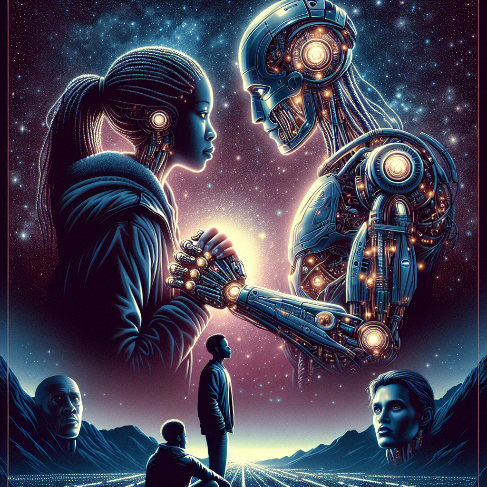

# "Love in the Mechaverse" (Originally -transformers-)
## Summary:
### Romanticized Summary of "Transformers":

In a world where the extraordinary meets the mundane, love transcends not just boundaries but the very fabric of reality itself. "Transformers" invites you to witness an epic tale of romance entwined in a battle of titanic proportions, where two factions of alien robots affect the fate of humanity and the hearts of a young couple.

At the heart of the narrative lies Sam Witwicky (played by Shia LaBeouf), an ordinary teenager who stumbles upon a powerful relic known as the AllSpark. Unbeknownst to him, this artifact draws the attention of celestial warriors — the noble Autobots, led by the valiant Optimus Prime, who seek to protect not only Sam but also the soul of Earth itself. Emerging from the shadows are the sinister Decepticons, led by the malevolent Megatron, whose desire for domination threatens to shatter the fragile peace.

As Sam grapples with his newfound destiny, he finds solace and passion in the company of Mikaela Banes (played by Megan Fox), an enchanting spirit who ignites a flame inside him. Their chemistry crackles with the energy of the cosmos as they work together, navigating treacherous landscapes and explosive confrontations. The world around them crumbles under the weight of an interstellar clash, yet amidst the chaos, their connection deepens, forged in the fires of battle and the sweet moments of vulnerability shared between them.

The climax unfolds in the luminous cityscape of Mission City, where love and heroism collide in a breathtaking showdown. As the Autobots and Decepticons clash in a visual symphony of might and bravery, Sam and Mikaela must summon their courage to thwart the encroaching darkness. With the fate of humanity and their burgeoning love hanging in the balance, they discover that true strength lies not just in their actions, but in the profound bond that unites them against all odds.

As the dust settles, "Transformers" reveals that even in the midst of war, love can illuminate the darkest of times, drawing connections between mechanical warriors and human hearts. A saga of transformation, this film beautifully intertwines action and romance, reminding us that amidst the fiercest battles, it’s love that ultimately saves the day.

### Details:
- **Director:** Michael Bay
- **Release Date:** July 3, 2007
- **Genres:** Action, Science Fiction, Romance, Adventure

Join Sam and Mikaela on this heartfelt
