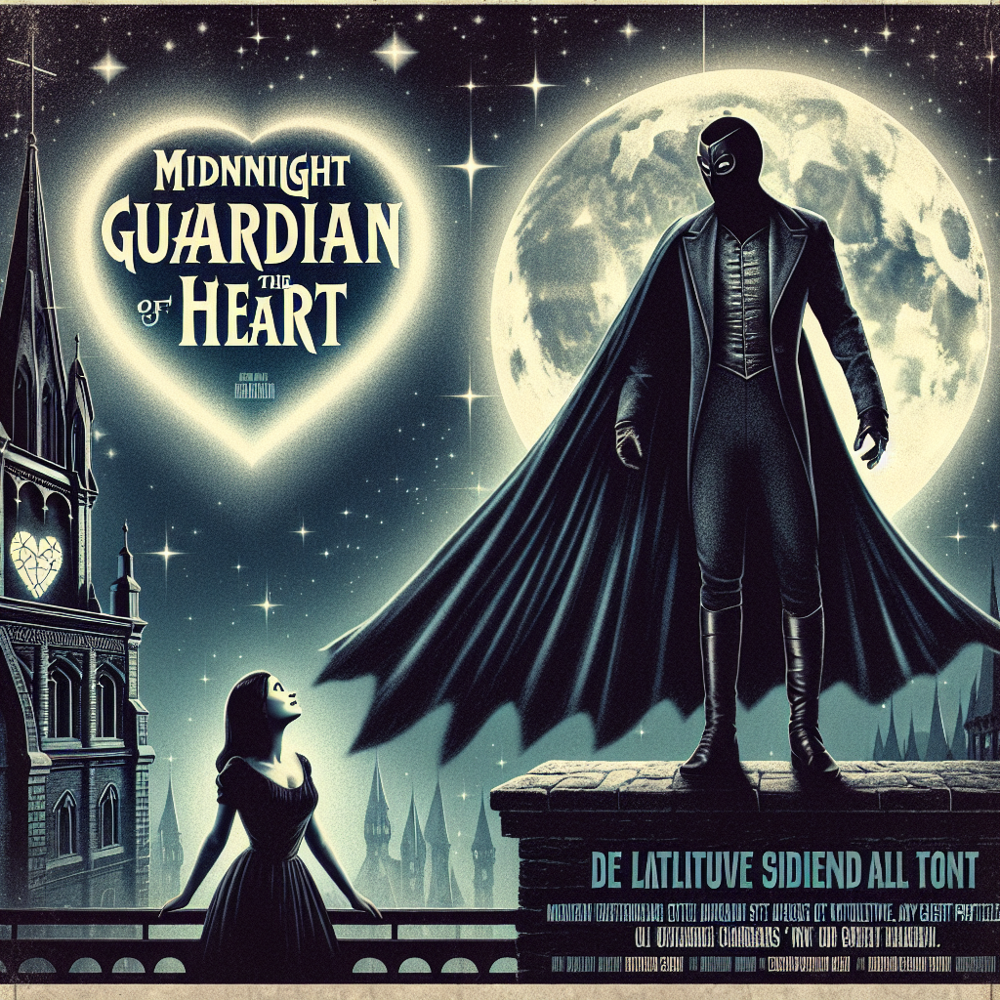

# "Midnight Guardian of the Heart" (Originally -batman-)
## Summary:
In the shadowy heart of Gotham City, where secrets lurk in every alley and despair hangs thick in the air like fog, a tale of love, revenge, and redemption unfolds. "The Batman," directed by the visionary Matt Reeves and brought to life by the brooding charisma of Robert Pattinson, presents a narrative where the lines between hero and villain blur in the dimly lit night.

This isn't merely a tale of masked vigilante justice; it is a torrid romance entwined with the dark fabric of the city’s underbelly. As Bruce Wayne, the conflicted soul behind the cowl, grapples with the weight of his mission to cleanse Gotham of its corruption, his heart quietly yearns for connection amidst the chaos. In the midst of darkness, he encounters the enigmatic Selina Kyle—played with fierce elegance by Zoë Kravitz. She is a tantalizing flame amidst the shadows, a seductive spirit clad in leather, who dances the treacherous line between ally and adversary.

Their fateful meetings become a whirlwind of electrifying tension, where stolen glances ignite a fire in Bruce that he thought long extinguished. Together, they delve into the twisted riddles left by the morbid mastermind known as the Riddler, portrayed chillingly by Paul Dano. Each clue draws them deeper into a web of intrigue that threatens to tear their fragile bond apart. 

The city around them is a battleground, not just for justice, but for their hearts—a place where love can ignite amidst the rubble of betrayal and despair. As they unearth the sinister truths behind the murders targeting Gotham’s elite, Bruce and Selina become more than just partners in crime-fighting; they are two lost souls seeking solace in each other's arms against the looming threat of danger.

But amidst the heart-pounding action, the stark collisions of morality, and the suffocating cloak of vengeance, Bruce must confront the ultimate question: can he uphold the mantle of the Dark Knight while allowing himself to love? Will their passionate bond survive the onslaught of chaos, or will Gotham's darkness extinguish the light they've found in each other?

"The Batman" transcends the typical superhero saga, weaving a richly romantic tapestry against a backdrop of mystery, as the melody of Michael Giacchino's haunting score envelops their story in a spellbinding embrace. In this dance of shadows and light, love might just be the strongest weapon of all, leading them on a journey that tests
