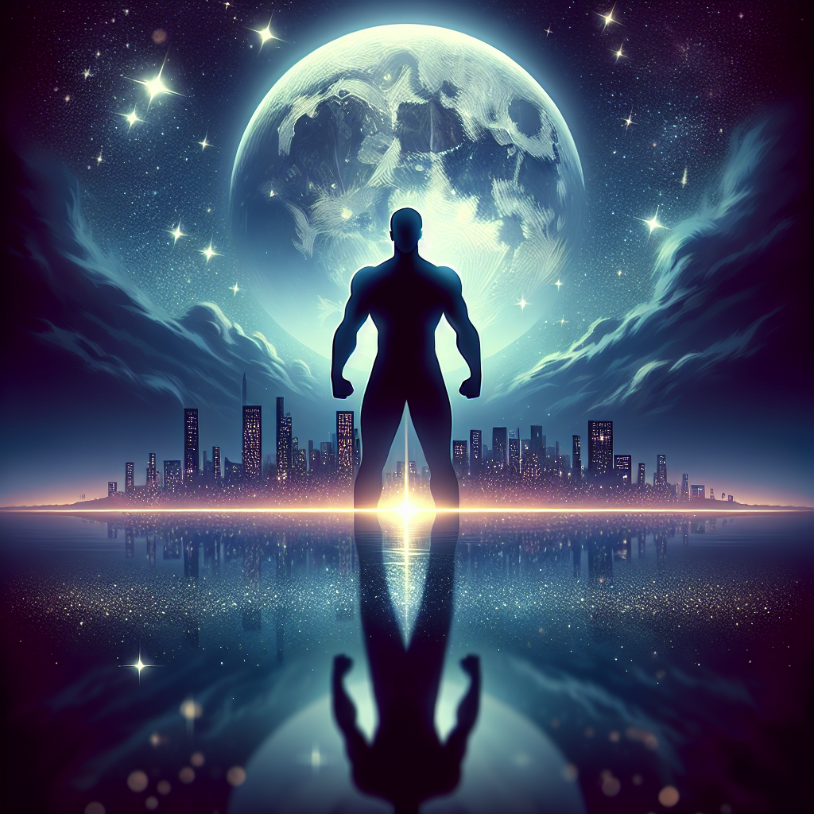

# "Midnight Lover" (Originally -black panter-)
## Summary:
In the heart of the lush and vibrant realm of Wakanda, where the air shimmers with technological marvels hidden from the prying eyes of the world, a tale of love, duty, and destiny unfolds. When the mighty King T'Chaka passes into the ancestral realm, the weight of the crown falls upon his son, T'Challa (Chadwick Boseman), a king who is both fearless and tender-hearted.

As T'Challa returns to his homeland, the throne awaits with its regal promises and hidden challenges. Among the towering trees and sweeping landscapes of Wakanda, the spirit of his father watches over him, urging T'Challa to forge his own path—not just as a ruler, but as a beacon of hope. Heart pounding and spirit ignited, he knows that his reign must embrace not only the legacy of his father but also the pulse of his people. Yet, from the shadows emerges Erik Killmonger (Michael B. Jordan), a man fueled by a fierce flame of vengeance, determined to seize the throne and rewrite the destiny of Wakanda.

But amidst the turmoil, a deeper connection calls to T'Challa. The enchanting Nakia (Lupita Nyong'o), a spy with a heart as audacious as her bravery, stands by his side. Their bond transcends the crown; it is a love entwined with shared dreams and whispered hopes—a spark of warmth that lights the coldest nights. As Nakia challenges T'Challa to see the world beyond the borders of their beloved Wakanda, he begins to confront the very essence of his identity and the intricate tapestry of his lineage.

With fierce allies by his side—Shuri (Letitia Wright), his brilliant sister who embodies ingenuity and spirit, and the unwavering Okoye (Danai Gurira), the fierce protector of their realm—T'Challa embarks on a journey not only to defend his kingdom but also to discover what kind of king he is meant to be. Torn between the pull of isolationism and the embrace of global responsibility, he grapples with the enormity of his role, yearning for wisdom and the strength to unite.

As the conflict with Killmonger intensifies, so too does the passion and intensity of T'Challa and Nakia's bond. In moments of quiet reflection, under the glow of Wakanda's starlit sky, they whisper dreams of a future nurtured by love, courage, and shared purpose—a
