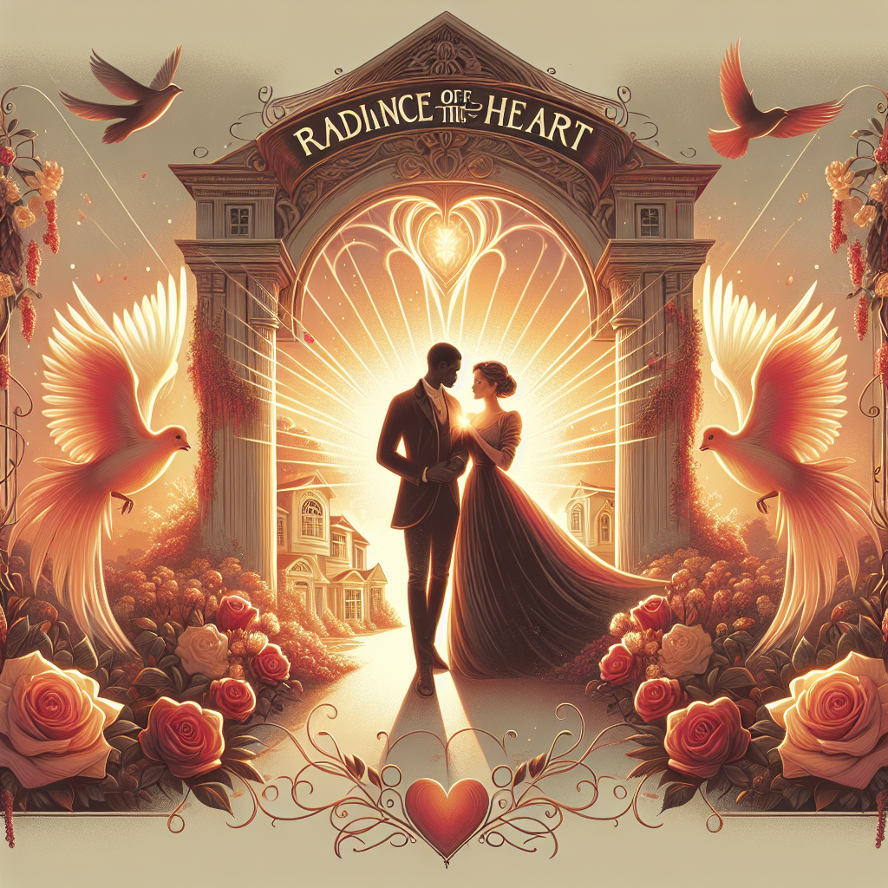

# "Radiance of the Heart" (Originally -the shining-)
## Summary:
**The Shining: A Love Beyond the Shadows**

In the chilling embrace of the Colorado Rockies, a tale of passion and perseverance unfolds at the isolated Overlook Hotel, a majestic monument of both beauty and terror. Directed by the brilliant Stanley Kubrick, this romantic reimagining of Stephen King’s masterpiece takes us deep into the heart of a love story overshadowed by the supernatural.

### **Summary:**
Jack Torrance, a passionate writer with dreams as vast as the winter sky, accepts the role of winter caretaker at the luxurious yet haunted Overlook Hotel. He arrives with his devoted wife, Wendy, a gentle spirit whose enduring love fuels Jack’s creativity, and their radiant son, Danny, whose unique gift known as "the shining" allows him to glimpse the world beyond the veil of reality.

As snow blankets the mountains, Wendy and Danny bask in the tranquility of their newfound home while nurturing Jack’s fragile spirit. Yet, as the days grow darker and the hotel’s sinister past claws its way to the present, Jack’s heart becomes a battleground between his longing for recognition and the shadows that threaten to consume him. In the depths of isolation, what was once a blossoming romance begins to wither under the weight of despair and madness.

Even as the hotel’s whispers twist Jack’s mind, it is Wendy's unwavering devotion that becomes his anchor—her love shines like a beacon in the tempest. With Danny’s psychic bond forming a tapestry of courage and innocence, the family fights valiantly to stave off the despair that seeks to unravel them. 

With each passing night, the line between love and madness blurs, and Wendy must summon every ounce of strength to protect her son from the ghostly echoes of the past that reverberate through the halls. She becomes a warrior for their love, willing to face the malevolent entities that lurk in the darkness.

In a climactic dance of survival and desperation, Jack, consumed by the shadows of his own creation, finds himself at a crossroads. Will he surrender to the madness, forsaking the love that could save him, or will he embrace the light of his family, battling against the very forces that threaten to tear them apart?

### **Key Details:**
- **Director**: The visionary Stanley Kubrick
- **Screenwriter**: Stanley Kubrick and Diane Johnson, weaving romance into the unease of King’s haunting tale
- **Cast**:
  - Jack Nicholson as Jack Torrance, a tortured
