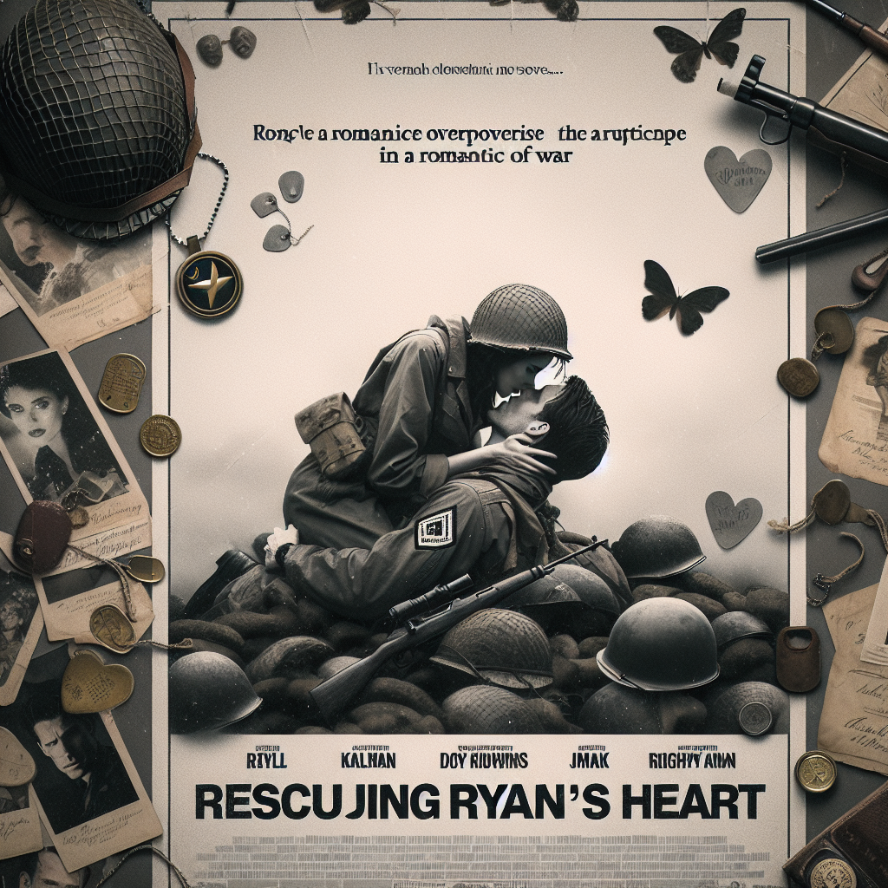

# "Rescuing Ryan's Heart" (Originally -saving private ryan-)
## Summary:
**Title: The Heart's Crusade**

In a time of turmoil, when the world was engulfed in chaos, love flickered like a candle fighting against the darkness. It was June 6, 1944, a day when valor danced at the edge of despair, and fate wove its intricate tapestry upon the sands of Omaha Beach. Here, amidst the thunder of artillery and the cries of the brave, Captain John Miller (embodied by the ever-heroic Tom Hanks) emerged, not merely as a soldier, but as a beacon of hope. His heart beat in rhythm with the aspirations of a nation, yet within him resided a deeper quest — the pursuit of love that transcended the battlefield.

When the news struck Captain Miller like a cruel gust of wind, it was not merely three lives lost that saddened him; it was the haunting thought that a mother could lose her entire heart in one sweep of war. Three Ryan brothers had laid down their lives in the line of duty, and now their ethereal sibling, Private James Ryan (danced upon the screen by the soulful Matt Damon), was lost somewhere in the embrace of France, paratrooping into the unknown. The mission became clearer than any compass; Miller was not just to save a soldier but to restore hope to a shattered family.

Gathering a diverse squad of souls bound by duty and dreams, each with stories as rich and vibrant as an artist’s palette, Miller embarked on this noble quest behind enemy lines. Sergeant Horvath stood stalwartly by his side, while the spirited Sergeant McGreevy cracked jokes even as the skies darkened around them. It was in these moments of camaraderie and laughter that love blossomed amidst the stark realities of war. Their courage brought them closer than brothers, forging bonds unbreakable against the storm.

As they traversed the hostile terrains, every step was a dance with destiny and an encounter with fate. With hearts entwined, they faced daunting challenges and moral dilemmas that challenged their beliefs and unity. Each soldier carried a piece of home in their hearts, reminding them that love often carries the day, even in the darkest hours. The laughter shared over scarce rations, the whispered dreams of tomorrow, and the unyielding support for one another became their shared love story amidst devastation.

At last, the squad reached a crescendo of heart-stopping intensity as they closed in on Private Ryan. Here, love became a battlefield of its own —
