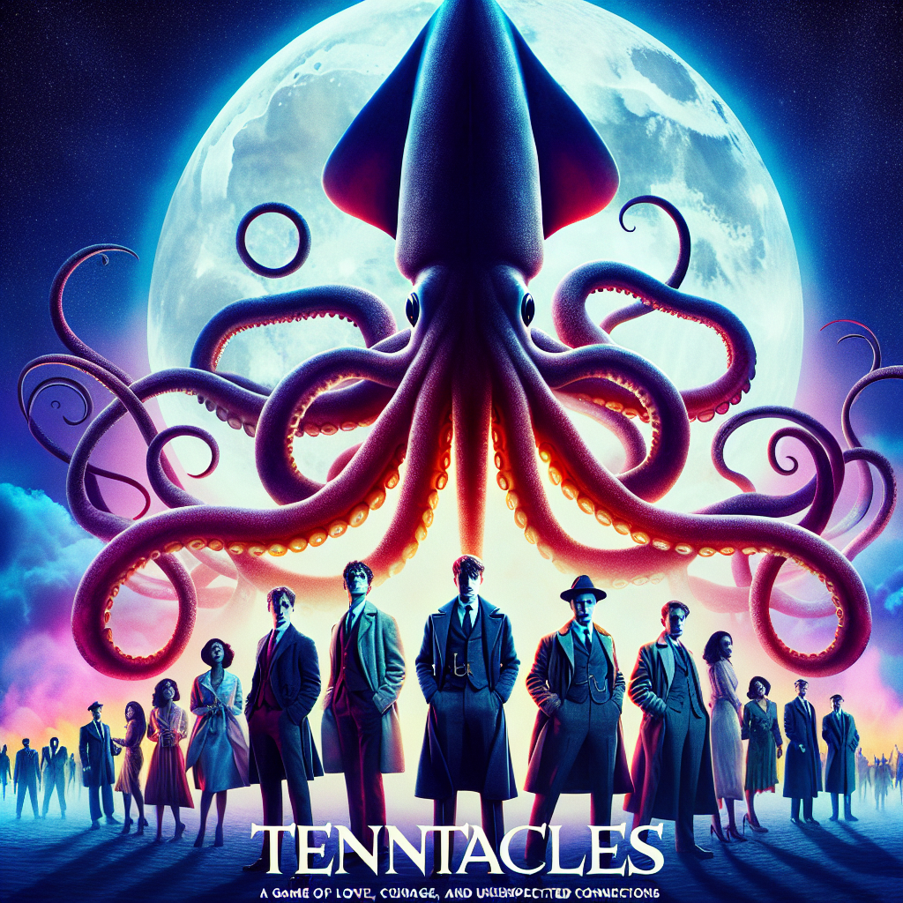

# "Tentacles of Desire" (Originally -squid game-)
## Summary:
In a world where desperation intertwines with longing, "Squid Game" transcends its thrilling premise to unveil a heart-wrenching tale of love, sacrifice, and the indomitable spirit of the human heart.

### Romanticized Summary

"Squid Game" beckons to the souls of 456 individuals, each entangled in the clutches of crippling debt and despair, who receive a mysterious invitation to a game that promises redemption. In a secluded paradise, lush yet perilous, they gather under the starlit skies, unaware that this sanctuary will transform into a battlefield of love and loss. 

At the heart of this tale stands Seong Gi-hun, a divorced father whose world has crumbled around him. Fueled by hope and haunted by his past, he enters the game not just for the staggering prize of 45.6 billion won, but to reclaim his dignity and a chance to reconnect with the daughter he cherishes. As the stakes rise and deadly challenges unfold, Gi-hun discovers that amidst the chaos, true connections blossom. 

Through the trials of childhood games turned ruthless, Gi-hun forms an unbreakable bond with the fierce and resilient Kang Sae-byeok. Together, they navigate through the brutal landscape, their hearts beating in sync as they cling to the fragile thread of survival. Friendship and loyalty sway like a dance of shadows as alliances are forged, love is both a shield and a target, and betrayal lingers in the air like an unspoken promise.

With masked figures orchestrating their every move, the contestants battle not only for survival but for the fleeting moments of warmth that ignite hope in their hearts. Each game becomes a testament to their humanity, revealing the lengths they will go to protect those they love. As Gi-hun fights through treachery and turmoil, he learns that wealth is not the only prize worth fighting for – the human connection, the love that blossoms against all odds, becomes the very essence of their struggle.

### Details 
- **Creators**: Hwang Dong-hyuk crafts an intricate tapestry of emotion and tension.
- **Genre**: A heart-pounding blend of romance, thriller, and drama, with survival at its core.
- **Seasons**: One season of breathtaking moments exists, with a second season fluttering on the horizon, teasing the promise of more intertwined fates.
- **Episodes**: Nine episodes dance between life and death, love and loss.
- **
