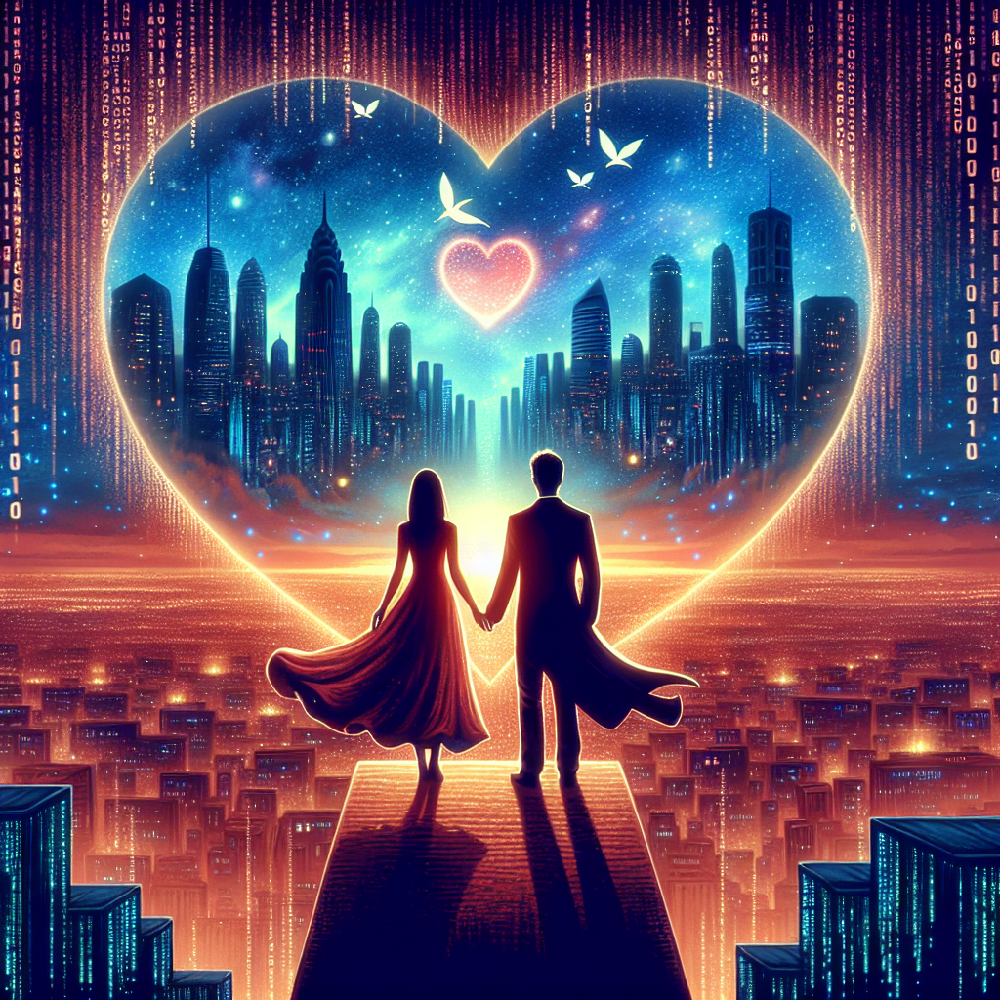

# "The Dream of Endless Love" (Originally -the matrix-)
## Summary:
**Title:** The Matrix of Hearts

**Release Year:** 1999

**Director:** Lana and Lilly Wachowski

**Genre:** Epic Romance, Science Fiction, Action

**Summary:**
In a world woven from shimmering threads of deception and boundless technology, there lies a love story that transcends time and the very fabric of reality. Meet Thomas Anderson, a disenchanted soul drifting through life, who exists under the alias Neo—a computer hacker yearning for something more profound than the empty pulse of the digital city. He wanders through the shadows of his mundane existence, longing to unravel the mysterious tapestry that surrounds him.

One fateful night, as he seeks solace in the depths of cyberspace, Neo receives an enigmatic message that pulls him deeper into the extraordinary. Contacted by the charismatic Morpheus, a leader of a band of rebels, he learns of a prophecy that heralds the arrival of "the One"—the beacon of hope destined to ignite a revolution against the cold, unfeeling machines that bind humanity. It is in this moment of awakening that Neo is also introduced to the fierce and stunningly beautiful Trinity, a warrior with a fiery spirit and an unquenchable thirst for freedom. Their hearts beat in tandem, each driven by a shared desire to break free from the confines of the Matrix—a simulated reality that holds humanity captive.

As the truth unfurls before him, Neo is enveloped in an electrifying journey of self-discovery, and amid intense battles with the menacing Agent Smith, a relentless foe determined to maintain the illusion of control, he learns not only to harness his incredible powers but also to embrace the longing that has always simmered within him. Each flicker of hope and every pulse of adrenaline magnifies the magnetic attraction between him and Trinity—a connection that sparks like fire in the darkest night.

In their quest to liberate humanity from the grasp of the machines, Neo and Trinity navigate a kaleidoscope of breathtaking landscapes and gravity-defying stunts, each leap and twist drawing them closer together. As they defy the laws of physics, their love becomes a force that transcends the boundaries of their reality—a love so vibrant that it sparks an awakening in others, igniting a shared passion for freedom across the world.

In the climactic confrontation against the powerful forces of the Matrix, Neo must confront not only the relentless Agent Smith but also his own fears and doubts. The finale resonates with the perfect harmony of action and romance
