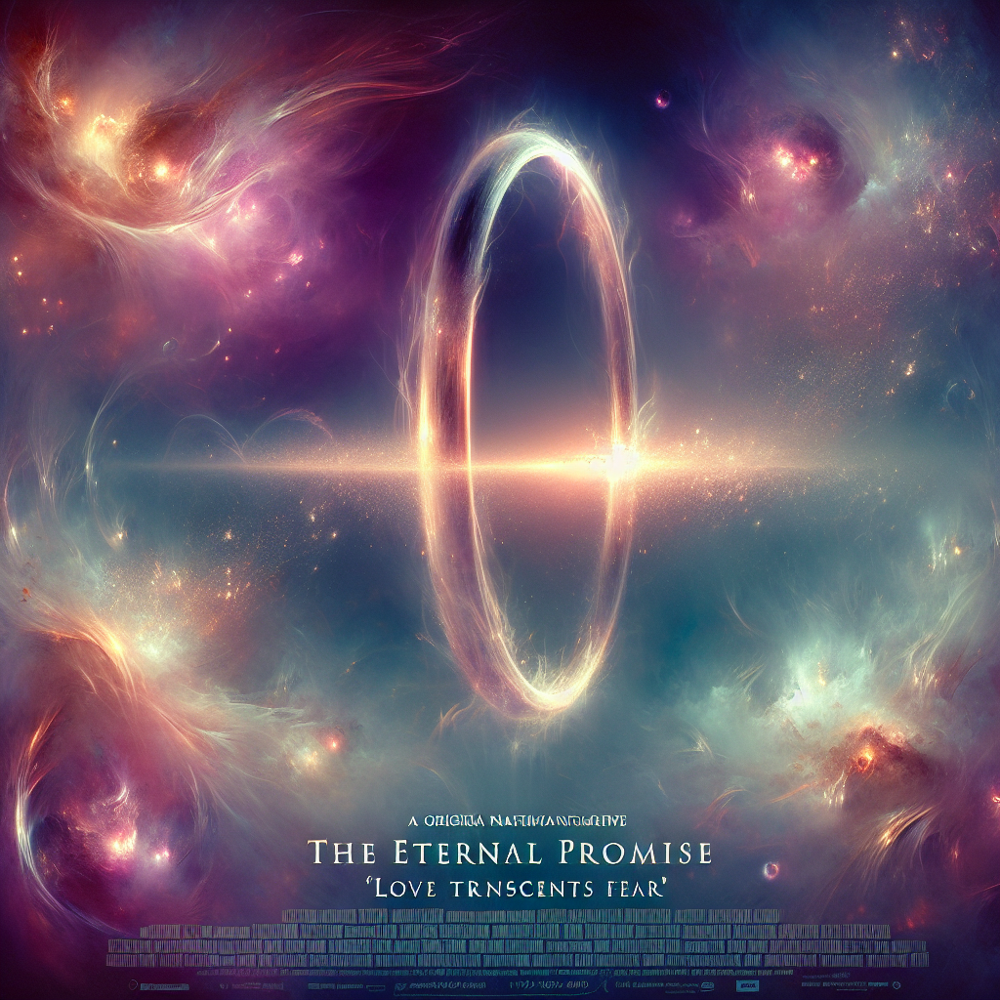

# "The Eternal Promise" (Originally -the ring-)
## Summary:
**The Ring: A Love Born from Darkness**

In the dim glow of a haunted world, love emerges amidst despair in “The Ring,” a tale spun from the threads of psychological horror and woven with the passion of heart and sacrifice. Directed by the visionary Gore Verbinski and graced with the powerful performance of Naomi Watts, this 2002 film takes us on an emotional journey through the unknown.

Rachel Keller, an intrepid journalist, finds herself irrevocably drawn into the depths of mystery after tragedy strikes her family. When her cherished niece watches a cryptic videotape and meets a chilling end, Rachel’s heart becomes heavy with grief. Fueled by love and a fierce determination to protect her own son, Aidan, she embarks on a perilous quest to unveil the truth behind a malevolent curse that drags innocent souls into its abyss.

As Rachel bravely watches the eerie tape, visions of a tormented girl named Samara arise—her sorrowful eyes and haunting presence awaken something deep within Rachel’s heart. Amidst the surreal and terrifying imagery, she begins to comprehend the fragile bonds that connect them, feeling an undeniable pull towards Samara's tragic past. The lace of their fates intertwines, whispering of secrets longing to be revealed and souls yearning for peace.

With only seven days to unravel the enigma, Rachel unites with her ex-boyfriend Noah, played by the charming Martin Henderson. Their shared history ignites a flicker of hope in the midst of despair. As they traverse the shadowy paths of the mystery together, old feelings resurface, reminding them of a love that once thrived, now tempered by the urgency to save what remains. Their journey is not merely a race against time, but a journey of rediscovery—finding solace and strength in each other as they confront their past and the horrors that threaten their future.

As the countdown echoes in their hearts, love becomes their greatest weapon against the encroaching darkness. Rachel’s unwavering devotion to Aidan shines like a beacon of light, while the bond with Noah rekindles the warmth of hope amidst fear. Together, they face seemingly insurmountable odds, unraveling the tragic tale of Samara’s sorrow and finding a way to lift the curse that binds them all.

In “The Ring,” beneath the chilling layers of suspense lies a profound story of love—love that transcends the veil of death, igniting compassion in the face of despair, and ultimately revealing that
