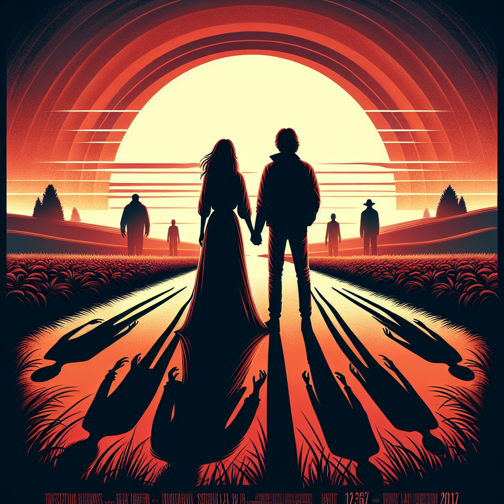

# "Us Against the World" (Originally -it-)
## Summary:
In the eerie twilight of Derry, Maine, where shadows whisper secrets of the past, a vibrant tapestry of friendship blossoms amid the lingering darkness. In the summer of 1989, a band of seven misfit souls, known fondly as the Losers Club, emerges from the depths of loneliness to forge an unbreakable bond. Each child carries the weight of their scars—those tender hearts burdened by the cruelty of a world that has often overlooked them.

Amidst their laughter and shared dreams, they discover an unimaginable horror that lurks just beyond their innocent laughter—a shape-shifting entity that cloaks itself in the guise of Pennywise, a sinister clown with a devilish smile. But fear not! For love, friendship, and courage intertwine in their journey as they confront the shadowy intricacies of their fears and insecurities.

Among them is the tender-hearted Ben, who harbors a secret crush on the fearless Beverly, a girl whose fiery spirit ignites hope in the darkest corners of their town. Their eyes meet across the playground, and in that fleeting moment, a spark ignites—a promise of bravery against the odds. Beverly's warmth nurtures Ben's courage, and together they unveil their hidden strengths, battling the sinister clown that haunts their dreams.

Bill, the determined leader, wrestles with his own grief while finding solace in the loyalty of his friends. With every heart-pounding encounter, the Losers Club learns that love is a formidable weapon, transforming fear into fortitude. They rally together, standing hand-in-hand against Pennywise, weaving a tale of resilience and unyielding hope.

As they navigate the treacherous waters of adolescence, the laughter shared among this extraordinary group becomes a melody that drowns out the dread. Each confrontation with their deepest fears only serves to strengthen their hearts, as they learn that love—a love forged in the fires of friendship—can conquer even the darkest of evils.

In this enchanted summer, where innocence dances with danger, the Losers Club discovers that the bonds of love and friendship can illuminate the path through even the darkest of storms. Their defiance against fear becomes a symphony of resilience, echoing throughout Derry—a timeless reminder that together, they can slay the monsters that dwell both in the shadows and within themselves.

In a theatrical crescendo of friendship and courage, "It" becomes much more than just a tale of horror; it evolves into a poignant journey where love triumphs,
