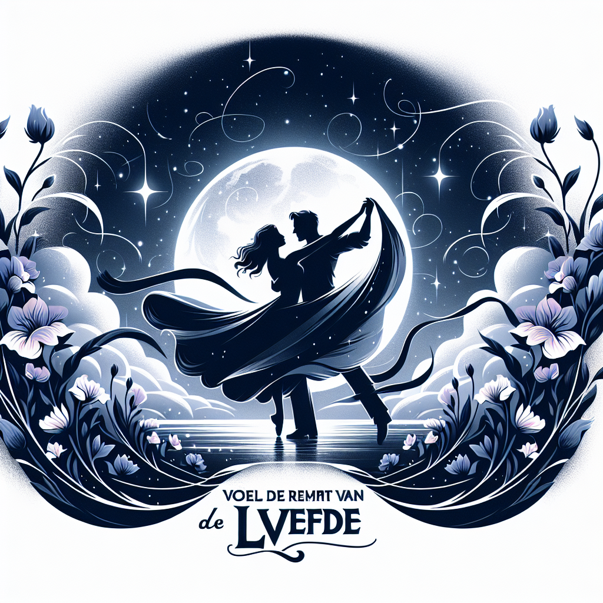

# Voel de Ritme van de Liefde (Originally -feel the beat-)
## Summary:
### Romantische Versie van de Samenvatting van "Feel the Beat"

In de betoverende film "Feel the Beat", die de harten van velen veroverde toen deze in juni 2020 op Netflix verscheen, volgt een meeslepende romantiek die zich ontvouwt op de ritmes van de dans. Onder de vakkundige regie van Elissa Down, schittert de getalenteerde Sofia Wylie als de dromerige April, een jonge vrouw die haar hart heeft verpand aan de danskunst.

Na een gefaalde auditie op de beroemde Broadway, keert April teleurgesteld terug naar haar pittoreske geboortestad. Terwijl ze zich omringt door de vertrouwde geur van nostalgie, voelt ze haar dromen vervagen, maar het leven heeft nog steeds een verrassing voor haar in petto. Als ze de unieke kans krijgt om een groep kleurrijke jongeren te onderwijzen in een lokaal dansstudio, is ze aanvankelijk met tegenzin, maar de vonk van passie kan niet worden genegeerd.

Ongelooflijk onhandig en ongetalenteerd lijkt de groep dansers op het eerste gezicht, maar als April de barrières tussen hen weet te doorbreken, ontstaat er een magische band. Terwijl ze samen de dansvloer betreden, ontdekt ze niet alleen de vibrerende energie van haar leerlingen, maar ook opnieuw haar eigen verloren liefde voor de dans. Hun schaterlach en gedrevenheid weerspiegelen haar vernieuwde hoop en de sprankeling in haar ogen.

Naarmate de grote danswedstrijd nadert, bloeit er een mooiste liefde op; niet alleen tussen April en haar leerlingen, maar ook in haar eigen hart. Begeleid door hun vastberadenheid en het onverwoestbare geloof in elkaar, voelt April een diepere connectie met de dans én met een bijzondere mentor die de weg naar haar hart lijkt te weten te vinden. De muziek tilt hen op, en met elke draai, elke sprongetje, en elk gevoel dat tot leven komt, herontdekt April haar zelfvertrouwen en haar verlangen om te schitteren.

"Feel the Beat" is meer dan alleen een verhaal over dans; het is een ode aan de veerkracht van de menselijke geest, de schoonheid van vriendschap en de magie van de liefde die ons samenbrengt. Deze hartverwarmende film zal kijkers van alle
