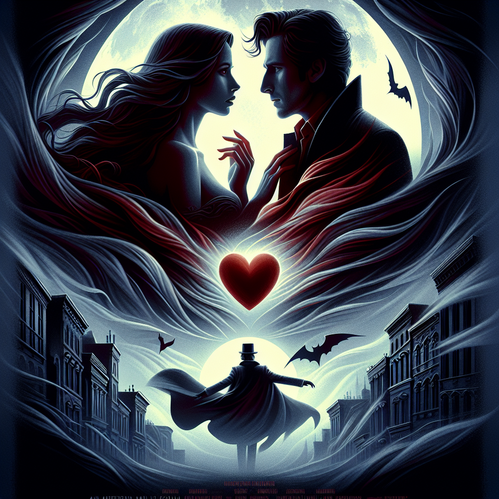

# "Whispers of the Heart" (Originally -scream-)
## Summary:
**Title: Whispers of the Heart: A Love Story Amidst Shadows**

In the quaint town of Woodsboro, California, where the gentle breeze carries secrets from the past, young Sidney Prescott is more than just a high school student; she is a beacon of resilience and hope. A year after the haunting loss of her mother, Sidney’s heart grapples with shadows that linger—a prison forged by grief and fear. But amidst the darkness, the flickering light of love begins to emerge.

The tale unfolds one fateful evening as a chilling phone call shatters the quietude. Our heroine’s friend, Casey Becker, portrayed by the enchanting Drew Barrymore, becomes the tragic muse of this chilling saga, a victim of a malevolent force known as Ghostface. Yet, through the horrific whispers of despair, Sidney finds the strength to rise, emboldened by the unwavering support of her circle and a budding romance that kindles hope.

At the heart of this tumultuous storm stands Billy Loomis, portrayed with earnest charm by Skeet Ulrich. He is not merely a friend but a guardian of Sidney's heart, propelling her into the depths of her fears while bringing warmth to her soul. Alongside the insightful and ever-quirky Randy Meeks and the loyal Deputy Dewey Riley, our brave protagonist embarks on a journey not only to unravel the mystery of the Ghostface killer but also to rediscover herself, sparking a fiery connection that transcends mere friendship.

In this delicate dance between danger and desire, each confrontation with the masked tormentor becomes a lesson in vulnerability and trust. With every friends' heartache and every whispered fear, Sidney learns that courage is not the absence of fear but the resolve to embrace love, even amidst the uncertainty of life and death. The "rules" of horror films become the backdrop for a passionate exploration of the soul, where the greatest victory lies in love's ability to heal.

As the town grapples with hysteria and whispers of treachery, Sidney must confront not just the specter stalking her but the very essence of love that could guide her through the storm. Will she find the strength to reclaim not only her life but her heart from the shadows? Will love blossom in the face of terror, blooming defiantly against the dark?

“Whispers of the Heart: A Love Story Amidst Shadows” peels back the layers of horror to reveal a tender narrative that intertwines passion and peril—a reminder that even
